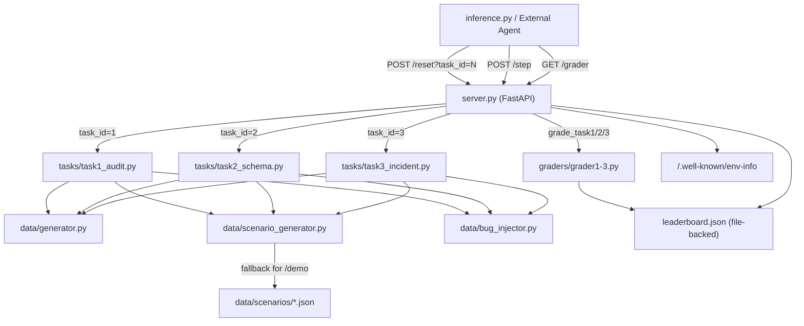

# DataPipelineEnv Architecture

## System Overview

## Component Responsibilities

| Component | Role |
|-----------|------|
| `server.py` | FastAPI app, routes, leaderboard persistence |
| `tasks/task{1,2,3}_*.py` | Environment state machine, step logic, reward shaping |
| `data/generator.py` | Seed-parameterized clean employee dataset |
| `data/scenario_generator.py` | Procedural bug injection spec from seed + task_id |
| `data/bug_injector.py` | Applies bug spec to DataFrame, builds ground_truth |
| `graders/grader{1,2,3}.py` | Stateless episode scorer, reads env attributes |
| `models.py` | Pydantic models for API I/O |
| `inference.py` | LLM agent loop (OpenAI-compatible) |

## Key Design Decisions

### Progressive Discovery
Agents start with an empty `discovered_bugs` set. `validation_report` only shows bugs the agent has explicitly surfaced via INSPECT. This enforces the investigation-first protocol.

### Procedural Generation
All live `/reset` calls use `generate_scenario(seed, task_id)`. Static JSON files are reserved for `/demo` only. This prevents memorization of a fixed 7-scenario lookup table.

### State Isolation
`_envs` is a module-level dict. The server runs with `--workers 1`. For multi-worker support, replace with Redis-backed sessions.

### Leaderboard Persistence
`leaderboard.json` is written on every `/grader` and `/record_score` call, protected by `threading.Lock()`. Survives soft restarts.
